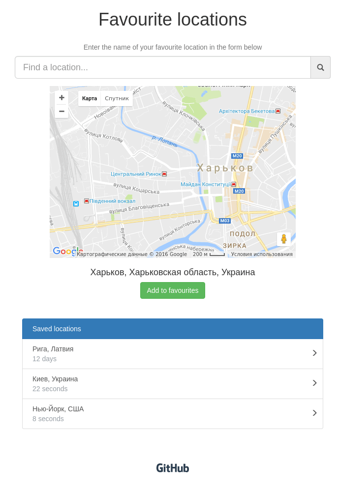

# React App

Example of React app with GMaps

## [Try it now](http://moonbrv.github.io/react-favourite-locations/)

### In this project I used:
- Webpack
- React
- Babel
- Some of ES6 features
- Mocha + Enzyme for unit tests
- GMaps for simplify work with google maps

### For building this project you need:

1. Download or Clone repository
2. Enter in folder in terminal
3. Execute command
  
  ```
  npm install
  ```
4. And then:
  
  ```
  npm start
  ```
  After build, enter in your browser <http://localhost:8080>, this is App on local server.
  
### Some of the app features
1. Enter the name Street or City and press Enter.
2. Click at the button near current location name. That action will save this location to the list of favourites locations. You can add several locations.
3. Click on some name in the saved locations list, the map and current location name will be switched to chosen location.

## Screenshot

